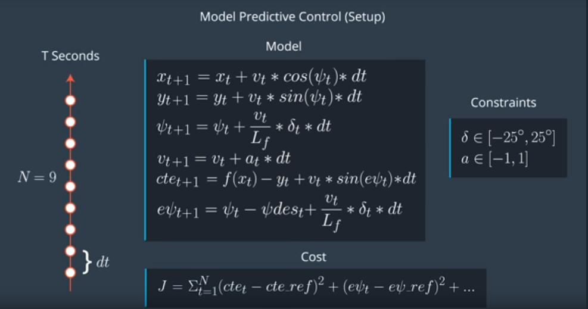

<H2> The Model </H2>
Model Predictive Control (MPC) is an optimization model which tries to minimize the difference between the model predicted value and the reference trajectory path which includes distance of the vehicle from the trajectory as well as vehicle orientation and trajectory orientation.
MPC is based on the following  
  1> Kinematic Vehicle Model 
  This model defines the state of the vehicle. state=[x, y, ψ, v] where x,y is the position of the car. ψ (psi) is the orientation with respect to the x-axis. v is the velocity of the vehicle.
  2> Dynamic Vehicle Model 
  This model covers longitudinal and lateral forces. 
  4> Actuator Constraints
  This defines the limitation for the vehicle. In this project, steering angle [denoted by δ] is limited between -25 degree to 25 degree. Similarly throttle/brake [denoted by a] is limited between -1 and 1 where -1 represents the brake and 1 is the full acceleration.
  
  Putting it all together, here's the diagram 
  
   
<H2> Timestep Length and Elapsed Duration (N & dt) </H2>
<H2> Polynomial Fitting and MPC Preprocessing </H2>
I did preprocessing of px, py, psi and velocity. I added latency and calculated state 100ms seconds ahead. This helped in giving better control to the car.
<H2> Model Predictive Control with Latency</H2>
